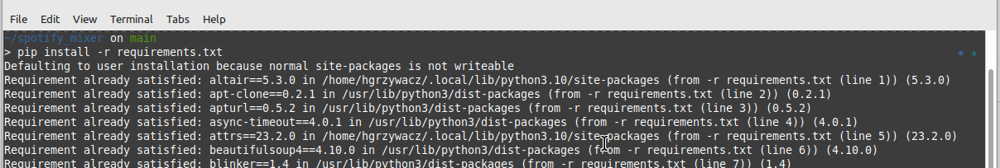
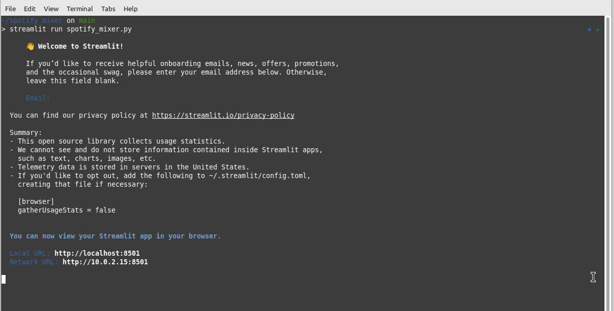
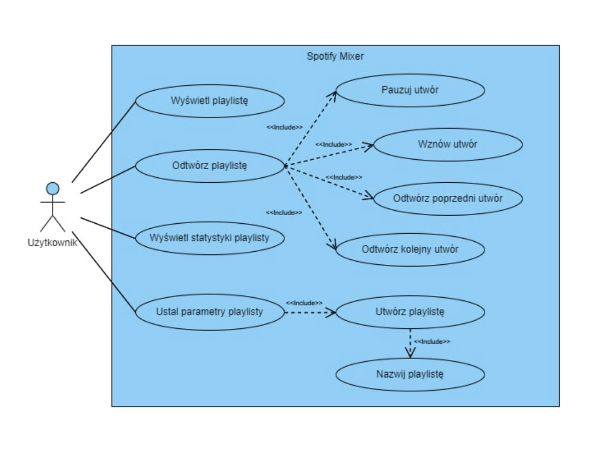

# Spotify mixer
Aplikacja Spotify Mixer współpracuje z serwisem Spotify i  z określonej puli utworów różnych gatunków tworzy specyficzne playlisty na podstawie analizy metadanych utworów, takich jak: tempo utworu, "akustyczność", "instrumentalność", "taneczność" i wiele innych.

Aplikacja obsługuje oferuje funkcjonalności: 
wbudowane playlisty o określonym klimacie/nastroju;
utworzenie własnej playlisty przez manualne dobranie parametrów;
przeglądanie statystyk wbudowanych i utworzonych playlist;
odtwarzanie playlisty - funkcje: play, pauza, poprzedni i następny utwór.


## Instalacja i uruchomienie

### Instalacja bibliotek

Wszystkie potrzebne biblioteki zapisane są w pliku `requirements.txt` i po sklonowaniu mogą być zainstalowane komendą

```
$ pip install -r requirements.txt
```



### Uruchomienie

```
$ streamlit run spotify_mixer.py
```




### Diagram użycia


